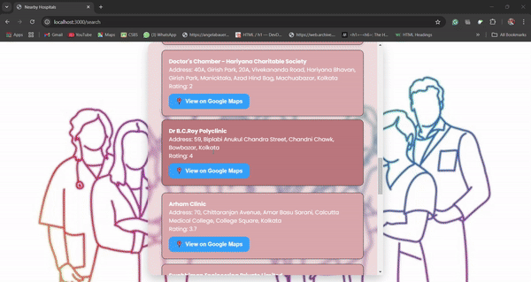

# Emergency Medical Aid Locator 🚑

The **Emergency Medical Aid Locator** is a web application designed to help users locate nearby hospitals by entering a place name. This project leverages the power of **Google Maps APIs** and is built with **Node.js**, **Express.js**, **EJS**, and **Axios**. It provides a user-friendly interface to display hospital details such as name, address, ratings, and links to view locations on Google Maps.

---

## Features ✨
- 🌍 **Search by Location**: Enter a place name to find nearby hospitals.
- 📍 **Google Maps Integration**: View hospital locations directly on Google Maps.
- ⭐ **Hospital Ratings**: Displays ratings (if available) for hospitals.
- 🎨 **Responsive Design**: Built with CSS for a seamless user experience across devices.
- 🛠️ **Error Handling**: User-friendly messages for invalid inputs or API errors.

---

## Technologies Used 🛠️
- **Frontend**: HTML, CSS, JavaScript
- **Backend**: Node.js, Express.js
- **Template Engine**: EJS
- **API Calls**: Axios
- **APIs**: Google Maps Geocoding API, Google Maps Places API

---

## APP UI

#### 1


#### 2



## Installation and Setup 🚀

1. **Clone the Repository**:
   ```bash
   git clone https://github.com/your-username/emergency-medical-aid-locator.git
   cd emergency-medical-aid-locator

2. **Install Dependencies:** Run the following command to install all required dependencies:
  ```bash
  npm install
```
3. **Set Up Environment Variables:** Create a .env file in the root directory and add your Google Maps API key:
```bash
GOOGLE_MAPS_API_KEY=your_api_key_here
```
4. **Run the Application:** Start the server with the following command:

```bash
npm start
```
5.**Access the App:** Open your browser and navigate to:
```bash
http://localhost:3000
```

---

## Usage Instructions 📖

1. **Enter a Location**:  
   Input the name of the place in the search bar (e.g., *New Delhi*).

2. **Search for Hospitals**:  
   Click on the **Search** button to find hospitals near the specified location.

3. **View Details**:  
   A list of hospitals will appear, displaying:
   - **Hospital Name**
   - **Address**
   - **Rating** (if available)

4. **Navigate via Google Maps**:  
   Use the **View on Google Maps** button to see the hospital location directly in Google Maps.

## AUTHOR

* PRAGNYA BASU

---


